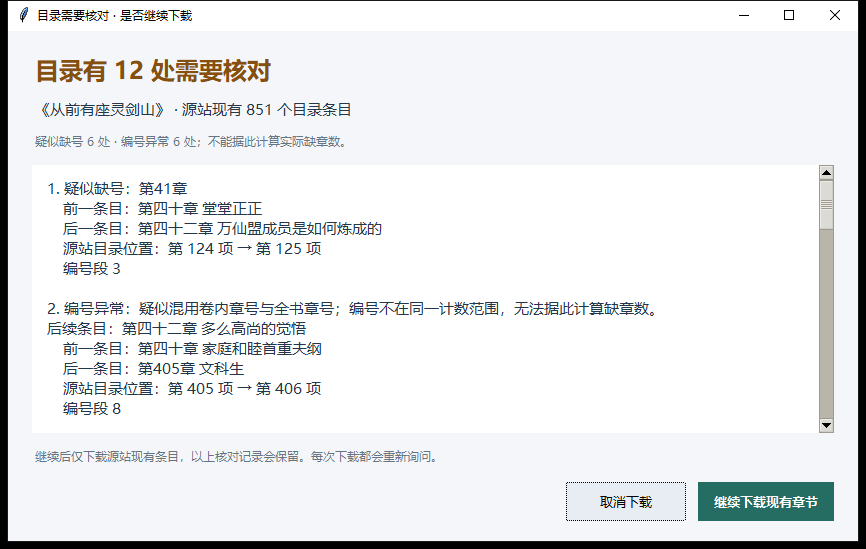

# 阅舟 YueZhou 1.8

Windows 桌面小说下载器。按书名搜索多个书源，查看作者、目录条目数和最新章节，再选择渠道下载 EPUB 或 TXT。使用 Python、Tkinter 和 PyInstaller。

## 功能

- 同名同作者渠道测速：读取目录，抽检首、中、末最多 3 章，显示结果及样本耗时；历史结果明确标记。
- 标准与加速模式、连接复用、缓存续传；遵守各书源并发和请求间隔限制，限流后自动降低并发并退避。
- 下载前核对目录；疑似缺号或混用卷内、全书章号时，先列出前后条目和目录位置，由用户决定是否继续。
- 校验正文标题、长度、重复内容和分页，完成后复核目录并回读成品。失败时保留缓存与问题记录。
- 完成弹窗显示实际保存位置，可打开文件或所在文件夹。

1.8 修复分卷小说混用两套章号时虚构大量缺章的提示。分析只标记问题，不删除条目、不改名、不重新排列章节。



## Windows 运行

安装包含 Tcl/Tk 的 Python 3；当前版本在 Python 3.13.2 上验证。在项目根目录打开 PowerShell：

```powershell
py -3 -m venv .venv
.\.venv\Scripts\python.exe -m pip install -r requirements.txt
.\.venv\Scripts\python.exe app.py
```

不需要激活虚拟环境。搜索和下载需要访问所选书源；网站状态、可读范围及访问限制可能变化。首次运行会生成用户配置和缓存，这些不纳入仓库。

## 测试

在项目根目录运行以下明确指定的 10 个模块，共 96 项单元测试。测试使用本地 HTTP 夹具、模拟响应与目录标题快照，不以实际网站可用性作为通过条件。

```powershell
.\.venv\Scripts\python.exe -m unittest -v `
  test_reliable_engine test_new test_fanqie test_search_repair `
  test_gap_confirmation test_download_speed test_request_policy `
  test_source_quality test_catalog_order test_volume_numbering
```

其中 `test_volume_numbering` 有 11 项回归，覆盖分卷混号、普通缺号、确认与取消、抽检不提前读取正文，以及保留原顺序的 EPUB 导出。测试可能在项目目录生成本地基准报告，已加入忽略规则。

`ui_*_check.py` 是需图形桌面的独立界面检查，不包含在上述 96 项中。`benchmark_speed_live.py` 和 `live_quality_check.py` 是手动真实站点检查脚本，会访问其指定网站，不随单元测试自动运行；仓库不附历史实测结果。

## 构建 EXE

```powershell
.\.venv\Scripts\python.exe -m PyInstaller --noconfirm YueZhou.spec
```

产物为 `dist/YueZhou.exe`，可独立运行。请在 Windows 上构建，并确保 Python 安装包含 Tkinter/Tcl/Tk。仓库也提供等效参数的 `build.ps1`。

## 目录结构

```text
app.py                         桌面界面与任务调度
reliable_engine.py             下载、缓存、章号核对及文件校验
search_engine.py / search_cache.py  多源搜索与历史结果
source_quality.py              同书渠道抽检、历史记录与排序
fanqie_source.py / fanqie_font.json  番茄公开网页适配
rules.json                     内置书源规则
test_*.py                      单元测试
testdata/                      分卷回归用目录标题快照
ui_*_check.py                  独立界面检查
YueZhou.spec / build.ps1        Windows 打包配置
docs/                          使用说明与界面示例
```

完整操作说明见 [使用说明](docs/使用说明.md)。

## 校验范围与来源

目录条目数可能包含公告、番外、感言或合章，不能当作作者正文总章数。章号跳跃也可能来自分卷、误编号或两套编号混用；程序展示的是需要核对的线索，不是已证明缺失的正文数量。

抽检通过不代表整本完整。下载成功表示当前源站目录中的条目通过程序检查，不能证明源站没有删节、错字、合章或尾部缺章，也不能证明作品已经完结。确认继续下载有疑问的目录后，报告仍保留这些问题。

书籍元数据和正文来自用户选择的第三方书源，软件不提供自有小说库。仓库不包含下载的小说正文、用户配置或访问凭据；`testdata` 仅保留用于回归的目录标题快照。番茄适配仅处理公开网页提供的内容，不绕过付费、锁定、登录或验证限制。

规则采用兼容 [SoNovel](https://github.com/freeok/so-novel) 的 CSS/XPath 结构。第三方规则和内容分别适用其自身的声明和许可。

本仓库暂未指定开源许可证，不额外授予第三方代码、书源或小说内容的许可。使用时请确认自己有权访问和保存相关内容。
